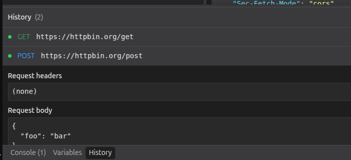

# Request History

A HarborClient plugin that records every successful HTTP request and response in a persistent footer panel.




## Features

- **History** footer toggle — slide-up panel matching Console and Variables
- Automatic capture on every successful send
- Entries persist across app restarts until you clear them
- Expand any row to inspect request and response headers and bodies

## Permissions

| Permission | Why                                                   |
| ---------- | ----------------------------------------------------- |
| `ui`       | Footer History panel                                  |
| `storage`  | Persist entries in plugin-scoped SQLite storage       |
| `http`     | Capture requests after each successful send           |
| `ipc`      | Bridge captured entries from main process to renderer |

## Development

```bash
pnpm install
pnpm build
```

Load the plugin in HarborClient:

1. Open **Settings → Plugins → Load unpacked…** and select this directory.
2. In the permissions dialog, click **Enable** (unpacked plugins stay disabled until you confirm).
3. Return to the request editor — a **History** button appears in the footer beside Console and Variables.

Or run HarborClient with:

```bash
HARBOR_PLUGINS_DEV=/path/to/harborclient-plugin-history pnpm dev
```

For live rebuilds:

```bash
pnpm dev
```

Then reload the plugin from Settings → Plugins.

## Packaging

```bash
pnpm pack
```

Install the resulting `request-history.hcp` from **Settings → Plugins**.

## Limitations

- Only **successful** HTTP responses are recorded (failed sends are not captured by the plugin API today).
- Request/response bodies are truncated at 64 KiB each to keep storage manageable.
- Duration, response size, collection name, and saved request name are not available from HTTP hooks.
- History cannot reload a request into the editor (not supported by the plugin API).
- Disabling the plugin stops new captures; existing data remains in storage. Uninstalling may leave data in the local database.
